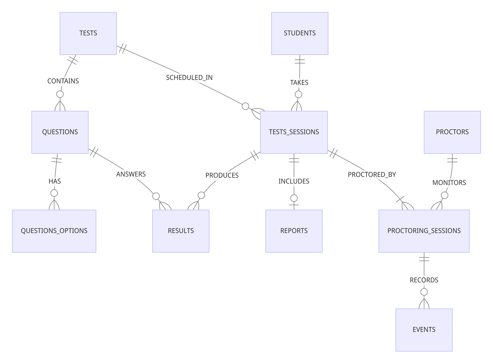

# Design Document

By Sunil Sharma

Video overview: [EMS - Youtube Video](https://youtu.be/CRT4_j3kZes)

## Scope

The purpose of the database is to manage a system for conducting tests and examinations. It includes all entities necessary to conduct tests, proctor test taker and producing results and reports of student performance. scope of database include:

* Students: Individuals taking tests basic info.
* Tests: Include basic info of tests/Examination, type and duration.
* Questions: Includes info about questions and their type.
* Questions options: Includes info about questions options and correctness.
* Test sessions: Instances of students taking tests, their status and time taken.
* Proctors: Individuals overseeing and monitoring test sessions.
* Proctoring sessions: Supervised sessions conducted by proctors during tests.
* Events: Records of activities and occurrences during test sessions.
* Reports: Summaries of test session results.
* Results: Outcomes of student responses to test questions.

The database focuses on managing the administration, execution, and monitoring of tests and examinations and focus only some core process of making tests sets of multiple option questions, but database scope does not delve into broader educational management aspects and things like user log acitivity, notifying user, finacial aspects, subjective answer type and many other aspect of proctoring and adminstration.

## Functional Requirements

This database will support:

* CRUD operation for students, tests, proctors, questions and their options.
* Create and manage tests, including setting instructions, duration, and questions.
* Assign tests to students and test sessions.
* Monitor and manage test sessions, including tracking student progress and proctoring activities.
* View and analyze test results, including scores, feedback, and overall performance.
* Generate reports summarizing test session outcomes.
* Record and review events occurring during test sessions, such as suspicious behavior or test completion.

The database primarily focuses on core facilities of test administration, monitoring, and analysis, rather than broader educational management or administrative tasks.

## Representation

Entities are captured in SQLite tables with the following schema.

### Entities

The database includes following entities:

#### Students

The `students` includes the following attributes:

* `id`: An `INTEGER` unique identifier for each student of type `INTEGER`. It is the `PRIMARY KEY` of the table, thus its constraint applied.
* `first_name`: This field stores the first name. It is of type `TEXT` to accommodate alphanumeric characters typically found in names.
* `last_name`: stores the last name of the student. It is also of type `TEXT`.
* `password`: Stores the password for student authentication. As it contains sensitive information, it is stored as `TEXT`. In a real-world scenario, it should be encrypted for security purposes.
* `email`: Represents the email address of the student, used for communication and authentication. It is of type `TEXT` and has a `UNIQUE` constraint applied.

All columns in the `students` table are required and hence should have the `NOT NULL` constraint applied. No other constraints are necessary.

#### Tests

The `tests` table has the following attributes:

* `id`: Unique identifier for each test of type `INTEGER`. It is the `PRIMARY KEY` of the table, thus its constraint applied.
* `title`: Stores the title or name of the test. It is of type `TEXT` and has a `UNIQUE` constraint to ensure each test has a unique title.
* `description`: Provides a brief description of the test. It is of type `TEXT`.
* `duration`: Represents the duration of the test, typically in minutes. It is of type `NUMERIC` to allow for decimal values if needed.
* `instructions`: Contains instructions or guidelines for taking the test. It is of type `TEXT`.
* `course`: Indicates the course associated with the test. It is of type `TEXT`.

All columns in the `tests` table are required and hence should have the `NOT NULL` constraint applied. No other constraints are necessary.

#### Questions

The `questions` table includes the following attributes:

* `id`: A unique identifier for each question of type `INTEGER`. It is the `PRIMARY KEY` of the table, thus its constraint applied.
* `test_id`: Represents the test to which the question belongs. It is a `FOREIGN KEY` referencing the `id` column in the `tests` table.
* `question`: Stores the actual question text. It is of type `TEXT`.
* `type`: Specifies the type of question, such as multiple choice or true/false. It is of type `TEXT`.
* `topic`: Represents the topic or category to which the question belongs. It is of type `TEXT`.
* `duration`: Indicates the duration allocated for answering the question, typically in seconds. It is of type `NUMERIC`.

All columns in the `questions` table are required and hence should have the `NOT NULL` constraint applied. No other constraints are necessary.

#### Questions Options

The `questions_options` table includes the following attributes:

* `id`: A unique identifier for each option of type `INTEGER`. It is the `PRIMARY KEY` of the table, thus its constraint applied.
* `question_id`: Represents the question to which the option belongs. It is a `FOREIGN KEY` referencing the `id` column in the `questions` table.
* `option`: Stores the text of the option. It is of type `TEXT`.
* `is_correct`: Indicates whether the option is correct or not of type `INTEGER` (`0` for incorrect, `1` for correct) and has a `CHECK` constraint to ensure valid values.

All columns in the `questions_options` table are required and hence should have the `NOT NULL` constraint applied. No other constraints are necessary.

#### Tests Sessions

The `tests_sessions` table includes the following attributes:

* `id`: A unique identifier for each test session of type `INTEGER`. It is the `PRIMARY KEY` of the table, thus its constraint applied.
* `test_id`: Represents the test being taken in the session. It is a `FOREIGN KEY` referencing the `id` column in the `tests` table.
* `student_id`: Represents the student taking the test session. It is a `FOREIGN KEY` referencing the `id` column in the `students` table.
* `start`: Indicates the start time of the test session. It is of type `NUMERIC` and has a default value of the current timestamp.
* `end`: Represents the end time of the test session. It is of type `NUMERIC` and may be null until the session is completed.
* `duration_taken`: Stores the duration taken for the test session. It is of type `NUMERIC` and may be calculated based on `start` and `end` timestamps.
* `status`: Indicates the status of the test session (in-progress, ended, completed). It is of type `TEXT` and has a `CHECK` constraint to ensure valid values.

All columns in the `tests_sessions` table are required and hence should have the `NOT NULL` constraint applied excepts for `end` and `duration_taken` which will be handled by their respective triggers(`set_end_for_test_session` and `update_status_end_final_score_all`). where in `end` calculated by `CURRENT_TIMESTAMP` + `duration` assigned in `tests`. where as `duration_taken` is updated when `status` is changed to `completed`, its time difference of `start` and time at status change. also `status` has `DEFAULT` value `in-progress` indicating session status and check constraint to limit values to (`in-progress`, `ended`, `completed`) which can updated when `students` complete `tests`.

#### Proctors

The `proctors` table includes the following attributes:

* `id`: A unique identifier for each proctor of type `INTEGER`. It is the `PRIMARY KEY` of the table, thus its constraint applied.
* `first_name`: Stores the first name of the proctor. It is of type `TEXT`.
* `last_name`: Stores the last name of the proctor. It is also of type `TEXT`.
* `password`: Stores the password for proctor authentication. It is of type `TEXT`.
* `email`: Represents the email address of the proctor, used for communication and authentication. It is of type `TEXT` and has a `UNIQUE` constraint applied.

All columns in the `proctors` table are required and hence should have the `NOT NULL` constraint applied. No other constraints are necessary.

#### Proctoring Sessions

The `proctoring_sessions` table includes the following attributes:

* `id`: A unique identifier for each proctoring session of type `INTEGER`. It is the `PRIMARY KEY` of the table, thus its constraint applied.
* `proctor_id`: Represents the proctor supervising the session. It is a `FOREIGN KEY` referencing the `id` column in the `proctors` table.
* `test_session_id`: Represents the test session being supervised. It is a `FOREIGN KEY` referencing the `id` column in the `tests_sessions` table.
* `start`: Indicates the start time of the proctoring session. It is of type `NUMERIC` and has a default value of the current timestamp.
* `end`: Represents the end time of the proctoring session. It is of type `NUMERIC` and may be null until the session is completed.
* `status`: Indicates the status of the proctoring session (active, completed). It is of type `TEXT` and has a `CHECK` constraint to ensure valid values.

All columns in the `proctoring_sessions` table are required and hence should have the `NOT NULL` constraint applied excepts for `end` which will be handled by trigger(`update_status_end_final_score_all`). where in `end` calculated by `CURRENT_TIMESTAMP`, when `status` is changed to `completed` in `proctoring_sessions`, and where as `status` has `DEFAULT` value `active` indicating session status and check constraint to limit values to (`active`, `completed`) which can updated when `students` complete `tests`.

#### Events

The `events` table includes the following attributes:

* `id`: A unique identifier for each event of type `INTEGER`. It is the `PRIMARY KEY` of the table, thus its constraint applied.
* `proctoring_session_id`: Represents the proctoring session associated with the event. It is a `FOREIGN KEY` referencing the `id` column in the `proctoring_sessions` table.
* `type`: Indicates the type of event (started-test, completed-test, ended-test, suspicious-behavior). It is of type `TEXT` and has a `CHECK` constraint to ensure valid values.
* `timestamp`: Represents the timestamp when the event occurred. It is of type `NUMERIC` and has a default value of the current timestamp.
* `description`: Provides additional description or details about the event. It is of type `TEXT` and has a default value of 'OK'.

`events` are mostly handled by triggers(`set_score_of_result` and `update_status_end_final_score_all`), only in case when `suspicious-behaviour` detected, than can be needed to inserted manually, which involve `INSERT` only `proctoring_session_id`, `type` and `description`, since `timestamp` has DEFAULT `CURRENT_TIMESTAMP`.

Having said that now!.. `NOT NULL` constraint only applies to all excepts `description` which has `DEFAULT` value `OK`, which only needed to be changed, IN case when `type` (which has check constraint (`started-test`, `completed-test`, `ended-test`, `suspicious-behavior`) and has `DEFAULT` value `started-test`), which is updated to `suspicious-behavior` which can be done manually. Now in case when student have no `suspicious-behavior`. then in that case `status` is normally updated to `ended` or `completed` based on `status` of `tests_sessions` and decription has `DEFAULT` value `OK` to indiacate normal activity.

#### Results

The `results` table includes the following attributes:

* `id`: A unique identifier for each result of type `INTEGER`. It is the `PRIMARY KEY` of the table, thus its constraint applied.
* `test_session_id`: Represents the test session associated with the result. It is a `FOREIGN KEY` referencing the `id` column in the `tests_sessions` table.
* `question_id`: Represents the question associated with the result. It is a `FOREIGN KEY` referencing the `id` column in the `questions` table.
* `answer`: Represents the chosen answer option for the question. It is a `FOREIGN KEY` referencing the `id` column in the `questions_options` table.
* `score`: Indicates the score obtained for the question (0 for incorrect, 1 for correct). It is of type `INTEGER` and has a `CHECK` constraint to ensure valid values.
* `feedback`: Provides feedback related to the answer. It is of type `TEXT`.

ALL the answer of test question is stored in `answer` attributes which takes `questions_options` table `id`'s with `test_session_id` and `question_id` REFERENCES. `score` and `feedback` is handled by trigger(`set_score_of_result`) which is based on `is_coorect` column for `score` to check if it's correct option or not, and `feedback` is based on correctness `score` (i.e `is_correct`) such that if option is incorrect feedback is set to `need-improvement` else `great`. `NOT NULL` constraint is applied to all excepts `feedback`.

#### Reports

The `reports` table includes the following attributes:

* `id`: A unique identifier for each report of type `INTEGER`. It is the `PRIMARY KEY` of the table, thus its constraint applied.
* `test_session_id`: Represents the test session associated with the report. It is a `FOREIGN KEY` referencing the `id` column in the `tests_sessions` table.
* `total_score`: Indicates the total score achieved in the test session. It is of type `INTEGER`.
* `final_score`: Represents the final score of the test session. It is of type `INTEGER`.
* `overall_feedback`: Provides overall feedback for the test session. It is of type `TEXT`.

All insertion in `reports` handled by trigger (`update_status_end_final_score_all`). Hence no `NOT NULL` constraint required.

### Relationships

The below entity relationship diagram describes the relationships among the entities in the database.

As detailed by the diagram:

* One student is capable taking 0 or many test session, 0, if they have yet to participate in test session of tests, and many if they particapate in many test session of tests (or takes more than one test session of any one test). Test session can have one and only one student as well as test. For obviuous reason here their is no group work.
* One test have 0 or many question, 0 when yet to be added and many when many added. while question contain one test. test can also have many test session taken by many different students, and test session can have one test only.
* One question has 0 or many question option, 0 when yet to be added and many when many added. while question options contain one question. each question can be anwered in multiple result (such that result can have mulitiple answer of same quetions by different test sessions) while result have one question.
* One Test session also produces 0 or many results for test sessions based on questions in test. 0 when no question is answered yet and many if many answered.
* One Result have one question while question have 0 or many result as said above and one result have one test session and while test session has 0 or many as said above.
* One reports have one test session while tests session have 0 or one report.
* One test session proctored by 1 or many proctoring sessions while proctoring session has one test session.
* one proctoring session is monitored by one proctor while proctor can monitor 0 or many proctoring session.
* One proctoring session records 0 or many reports while One event has one proctoring session.

## Optimizations

Several optimizations were made in the schema:

* Indexes:  
  * Indexes were created on various columns used frequently in queries to improve query performance. For example, indexes were added on columns like `student_id`, `test_id`, `question_id`, `is_correct`, etc. many other mentioned in in `schema.sql` for other table, based on several query mentioned in `queries.sql` can be seen their.
  * The purpose of adding indexes is to speed up common search operations, especially when filtering or joining large datasets.

* Views:
  * Views were created to simplify querying for common tasks. For example, the `tests_history` view provides a consolidated view of students' test performance history, while the `test_questions_option_search` view simplifies searching for tests and their associated questions and options and `test_sessions_suspicious_behaviour_search` view provides tests sessions where suspicious activity occured.
  * This views help in abstracting complex queries into simpler, reusable forms, enhancing the database's usability and reducing the complexity of queries for end-users.

These optimizations were implemented to improve the overall performance and usability of the database system by reducing query execution time and simplifying the querying process.

## Limitations

The current schema focuses only on some core process of test conducting, report generating and proctoring. It lacks other question type like subjective (long answers), which will require some change in database. It does not focuses administrative process of securing account and role based security on database.

Overall the current design meets the immediate requirements outlined, it may face challenges in handling more complex scenarios or evolving use cases without further refinement or expansion.
