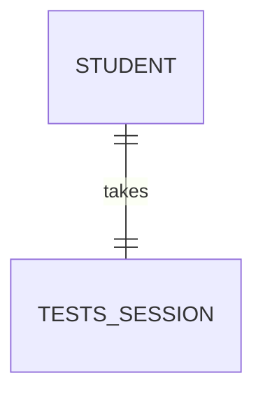
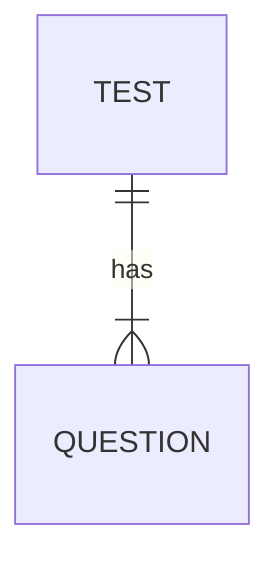
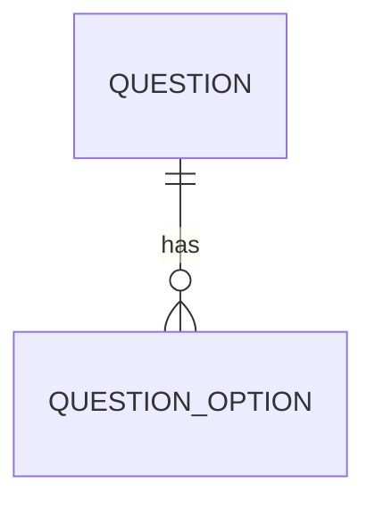
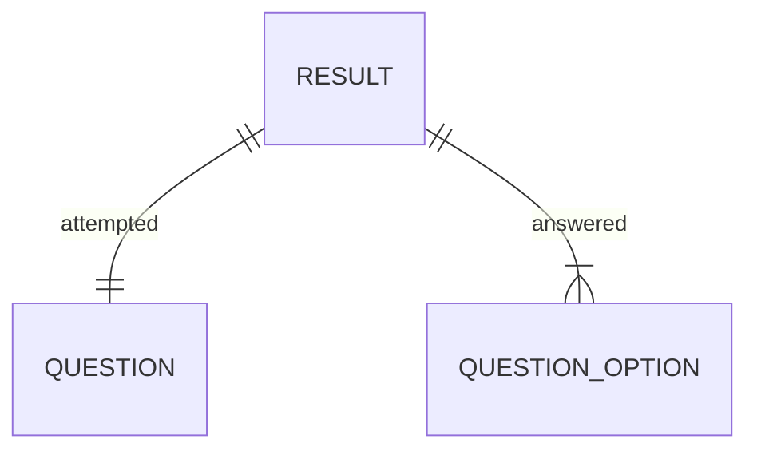
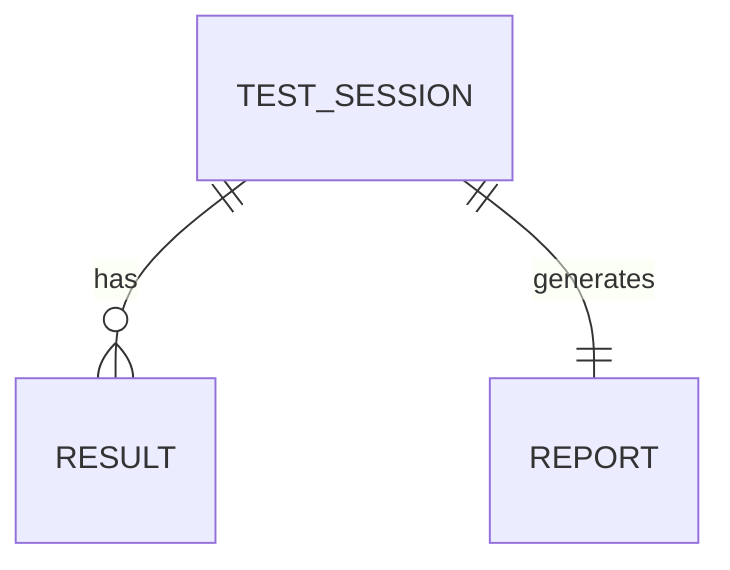
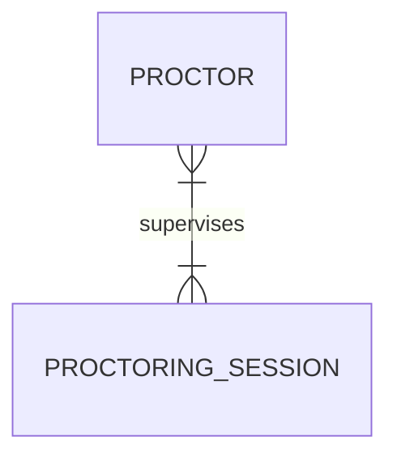
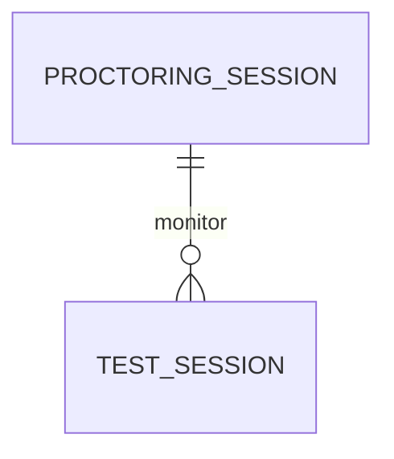
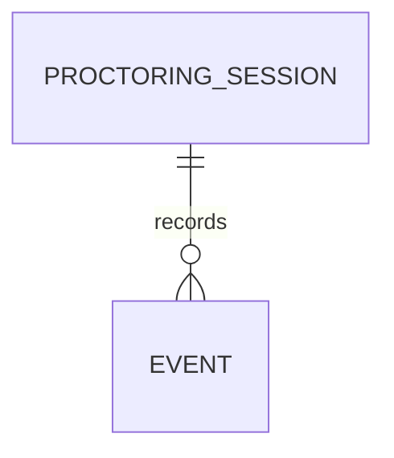

# **Exam Management System**

The Exam Management System database is designed to streamline the process of conducting tests and examinations. It encompasses all essential entities required for creating and managing tests, proctoring test-takers, and generating detailed results and performance reports. The system ensures efficient administration and monitoring while maintaining traceability and flexibility.

## Project Structural Overview

### **Directory Structure**

```sh
ems-db:             # root {WorkDir}
├───/assets          # MISC          
├───/docs            # Docs - study guide          
├───/mysql
├───/psql
├───/sqlite
├───DESIGN.md       # Schema Def
├───design.mmd      # Mermaid Schema def
└───README.md
```

```sh
# Common Files
WorkDir: root/[sqlite, mysql, psql]
├───|- ./tests/
        |- test_db.py       # pytest
    |- .dockerignore        ---   
    |- .gitignore             |  
    |- .python-version        |
    |- compose.yaml           |-- # ENV files
    |- Dockerfile             |
    |- pyproject.toml         |
    |- uv.lock              __|
    |- db.py                # Script
    |- queries.sql          # Batch queries         
    |- schema.sql           # Schema def
    |- README.Docker.md     <-- # Read for docker
    |- usage.md             <-- # start here
```

- **SQLite**, **MySQL**, and **PostgreSQL** folders contain database-specific implementations.
- Shared files like `db.py`, `queries.sql`, and `schema.sql` provide a consistent interface across all databases.
- This structure simplifies navigation and ensures modularity for multi-database support.

## ✨ Project Scope and Objectives

The database is tailored to handle the core processes of test management, including creating test sets with multiple-choice questions, proctoring test sessions, and producing performance reports. However, its scope is intentionally focused and does not cover broader educational management aspects such as user activity logging, notifications, financial transactions, subjective answer types, or other administrative features.

### Key Highlights

- **Core Focus:** Efficiently manage tests, proctoring, and result generation.
- **Traceability:** Maintain clear relationships between students, tests, sessions, and results.
- **Flexibility:** Support complex proctoring scenarios and large-scale test monitoring.
- **Modularity:** Designed for multi-database support with consistent file structures.

> ***Read*** [`design.md`](/design.md) `<<<` For more details.

## 🤔 Structural Overview

The following sections provide a detailed walkthrough of the database relationships, with special emphasis on complex entities like **PROCTORING_SESSIONS** and their connections to **PROCTORS**, **TESTS_SESSIONS**, and **EVENTS**.


---

### 👤 `STUDENTS` — `TESTS_SESSIONS`



- Each **student** takes exactly one **test session** per test.
- Each **test session** belongs to one student.

---

### 📘 `TESTS` — `QUESTIONS`



- A test can have many questions.
- Each question belongs to one test.

---

### ❓ `QUESTIONS` — `QUESTIONS_OPTIONS`



- A question can have multiple answer options.
- Each option is tied to one question.

---

### 📝 `RESULTS` — `QUESTIONS` / `QUESTIONS_OPTIONS`



- Each result is linked to one question (the one being answered).
- It references one of the options (via `answer`) that the student selected.

---

### 🧑‍🎓 `TESTS_SESSIONS` — `RESULTS` / `REPORTS`



- One test session has many results (per question).
- Generates exactly one report summarizing the session.

---

## 🔍 Proctoring Details

### 🛡️ `PROCTORS` — `PROCTORING_SESSIONS`



- A **many-to-many** relationship (represented as 1..* both sides).
- A proctor can participate in many **proctoring sessions** (e.g., rotating roles).
- A proctoring session can have multiple **proctors** supervising it (e.g., shared duty).

> This allows for a flexible proctoring team per session.

---

### 🎥 `PROCTORING_SESSIONS` — `TESTS_SESSIONS`



- A proctoring session can monitor multiple test sessions (e.g., group of students).
- Each test session can be observed under one or more proctoring sessions.

---

### 🧾 `PROCTORING_SESSIONS` — `EVENTS`



- Events are tied to proctoring sessions.
- These events are automatically triggered (via system rules and triggers).
  - `started-test`, `suspicious-behavior`, `ended-test`, etc.
- Useful for auditing and monitoring behavior during tests.

## 🧠 How This Works

- Ensures traceability from:
  - Student → Test → Test Session → Question → Answer (Result)
  - Proctor → Proctoring Session → Event (Audit Trail)
- Supports flexible supervision and large-scale test monitoring.
- Works well with database schema and the logic described (including triggers, views, etc.).

## 📗 Usage

> ***First :*** Change dir to specific implementation dir of db.

```txt
cd specific_db_dir
```

> **Dir's :** `sqlite`, `mysql`, `psql`

```sh
# eg. assuming in root
cd sqlite
```

Than, **Follow *`db-dir`* specific** `usage.md` or See links below 👇.

### 🔗 Links

- ***Read Usage***
    - [`sqlite usage`](/sqlite/usage.md)
    - [`mysql usage`](/mysql/usage.md)
    - [`psql usage`](/psql/usage.md)
- ***Read & Study Docs for differences across dbs***
    - [`Schema differences`](/docs/1-schema-diff.md)
    - [`Query & Interection differences`](/docs/2-query-interection-diff.md)

> **`Note :`** This repository is organized into `dedicated folders` for different relational databases, each following a consistent file structure. While the structure remains uniform, internal code adjustments are made to accommodate the specific nuances of each RDBMS.

## 📚 References

- [Understanding ER Diagrams](https://cs50.harvard.edu/sql/2024/notes/1/#entity-relationship-diagrams)
- [Mermaid Syntax - ER Diagrams](https://mermaid.js.org/syntax/entityRelationshipDiagram.html)
