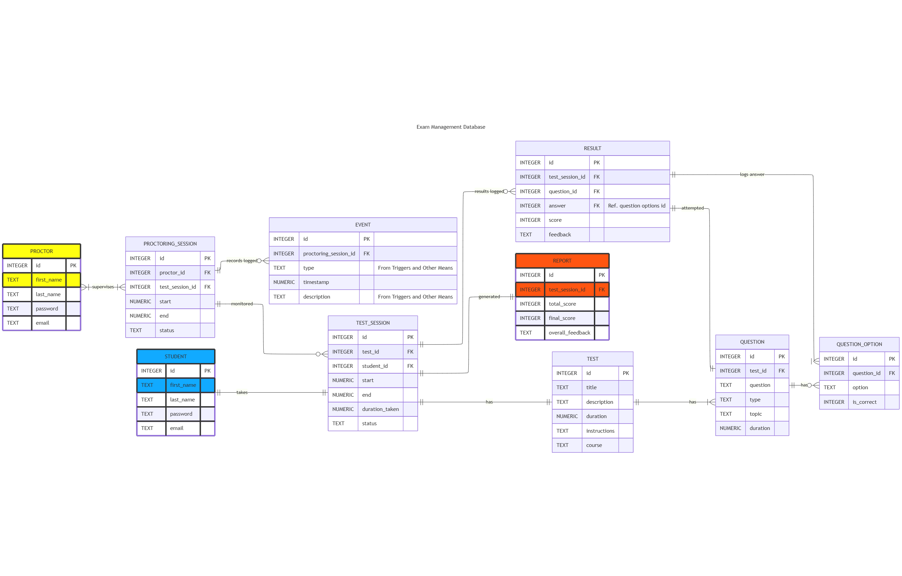
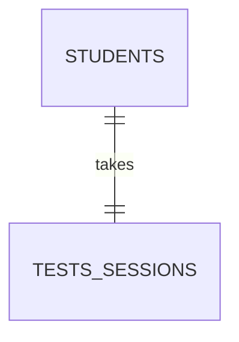
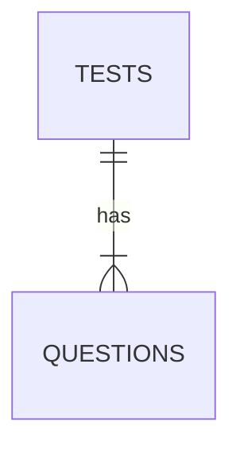
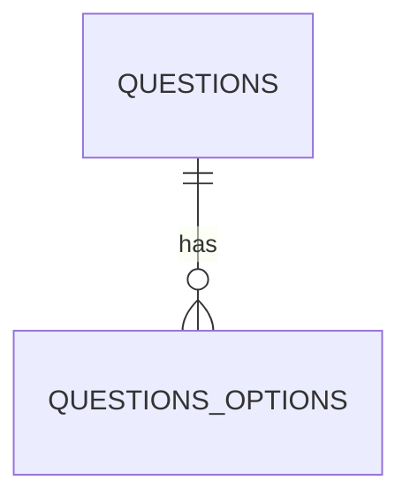
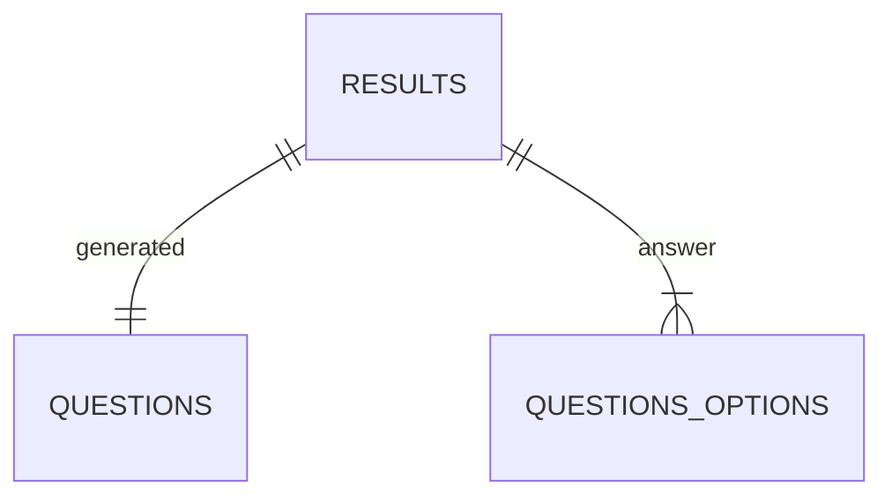
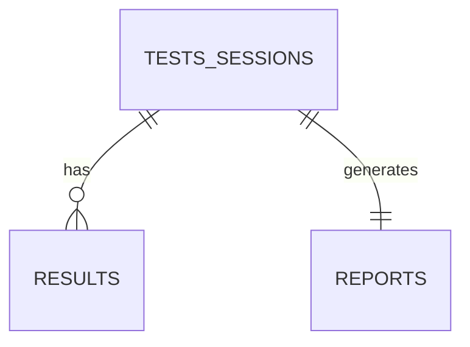
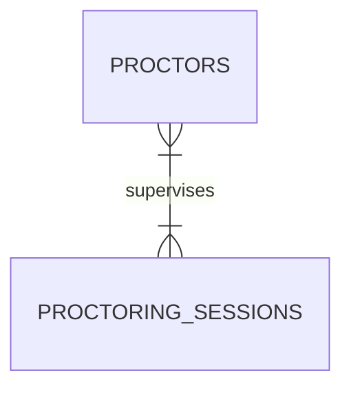
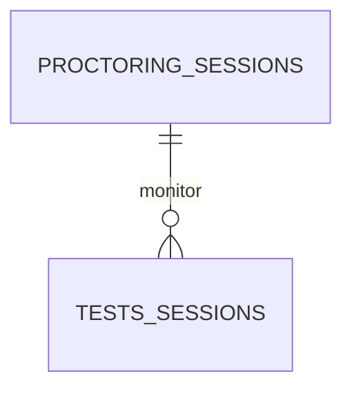
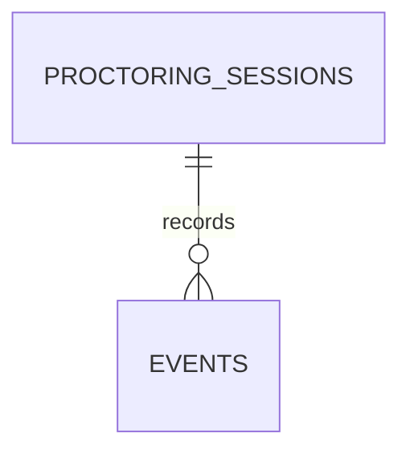

# **Exam Management System**

Let's walk through each relationship and especially the more complex ones like **PROCTORING_SESSIONS** and how it links to **PROCTORS**, **TESTS_SESSIONS**, and **EVENTS**.

---

## ✅ Diagram Structure Overview

### 👤 `STUDENTS` — `TESTS_SESSIONS`

- Each **student** takes exactly one **test session** per test.
- Each **test session** belongs to one student.

---

### 📘 `TESTS` — `QUESTIONS`

- A test can have many questions.
- Each question belongs to one test.

---

### ❓ `QUESTIONS` — `QUESTIONS_OPTIONS`

- A question can have multiple answer options.
- Each option is tied to one question.

---

### 📝 `RESULTS` — `QUESTIONS` / `QUESTIONS_OPTIONS`

- Each result is linked to one question (the one being answered).
- It references one of the options (via `answer`) that the student selected.

---

### 🧑‍🎓 `TESTS_SESSIONS` — `RESULTS` / `REPORTS`

- One test session has many results (per question).
- Generates exactly one report summarizing the session.

---

## 🔍 Proctoring Details

### 🛡️ `PROCTORS` — `PROCTORING_SESSIONS`

- A **many-to-many** relationship (represented as 1..* both sides).
- A proctor can participate in many **proctoring sessions** (e.g., rotating roles).
- A proctoring session can have multiple **proctors** supervising it (e.g., shared duty).

> This allows for a flexible proctoring team per session.

---

### 🎥 `PROCTORING_SESSIONS` — `TESTS_SESSIONS`

- A proctoring session can monitor multiple test sessions (e.g., group of students).
- Each test session can be observed under one or more proctoring sessions.

---

### 🧾 `PROCTORING_SESSIONS` — `EVENTS`

- Events are tied to proctoring sessions.
- These events are automatically triggered (via system rules and triggers).
  - `started-test`, `suspicious-behavior`, `ended-test`, etc.
- Useful for auditing and monitoring behavior during tests.

---

## 🧠 Why This Works
- Ensures traceability from:
  - Student → Test → Test Session → Question → Answer (Result)
  - Proctor → Proctoring Session → Event (Audit Trail)
- Supports flexible supervision and large-scale test monitoring.
- Works well with database schema and the logic described (including triggers, views, etc.).
